# Entity Relationship Diagram

Database: PostgreSQL (`meridian`).  
Relationships are logical — `ticker` is the common key across tables but no formal FK constraints are defined in the schema.

```mermaid
erDiagram

    %% ---------------------------------------------------------------
    %% UNIVERSE  (reference / master data)
    %% ---------------------------------------------------------------

    sp500_universe {
        string  ticker          PK
        string  company_name
        string  gics_sector
        string  gics_sub_industry
        string  updated_at
    }

    benchmark_tickers {
        string  ticker          PK
        string  category
    }

    %% ---------------------------------------------------------------
    %% LAYER 1 — Market data
    %% ---------------------------------------------------------------

    daily_prices {
        string  ticker          PK
        string  date            PK
        float   open
        float   high
        float   low
        float   close
        float   adj_close
        integer volume
    }

    fundamentals {
        string  ticker          PK
        string  period_type     PK
        string  period_end      PK
        float   revenue
        float   gross_profit
        float   operating_income
        float   ebit
        float   net_income
        float   total_assets
        float   total_equity
        float   total_debt
        float   cash
        float   cfo
        float   fcf
        float   roe
        float   roa
        float   gross_margin
        float   operating_margin
        float   net_margin
        float   debt_to_equity
        float   current_ratio
        float   cfo_to_ni
        float   accruals_ratio
        string  updated_at
    }

    short_interest {
        string  ticker          PK
        string  date            PK
        float   shares_short
        float   short_ratio
        float   short_pct_float
        string  fetched_at
    }

    analyst_estimates {
        string  ticker          PK
        string  date            PK
        float   eps_estimate_fwd
        float   price_target
        integer num_analysts
        string  fetched_at
    }

    earnings_calendar {
        string  ticker          PK
        string  earnings_date   PK
        float   eps_estimate
        string  fetched_at
    }

    earnings_transcripts {
        integer id              PK
        string  ticker
        string  earnings_date   UK
        string  quarter
        integer year
        text    content
        string  fetched_at
    }

    sec_filings {
        integer id              PK
        string  ticker
        string  form_type
        string  filed_date
        string  accession_no    UK
        string  filing_url
        text    content_text
        string  fetched_at
    }

    insider_transactions {
        integer id              PK
        string  ticker
        string  insider_name
        string  insider_title
        string  transaction_type
        string  transaction_code
        float   shares
        float   price
        string  date
        string  accession_no
        integer is_open_market
        integer is_ceo_cfo
        string  fetched_at
    }

    insider_cluster_flags {
        string  ticker          PK
        string  window_start    PK
        string  window_end
        integer insider_count
        float   total_shares
        string  flagged_at
    }

    institutional_holdings {
        integer id              PK
        string  fund_name
        string  ticker
        float   shares_held
        float   market_value
        string  report_date
        string  fetched_at
    }

    institutional_summary {
        string  ticker          PK
        string  report_date     PK
        integer funds_holding
        float   net_share_change
        integer new_positions
    }

    %% ---------------------------------------------------------------
    %% LAYER 2 — Factor scoring
    %% ---------------------------------------------------------------

    factor_scores {
        string  ticker          PK
        string  score_date      PK
        string  sector
        string  regime
        float   momentum_score
        float   value_score
        float   quality_score
        float   growth_score
        float   revisions_score
        float   short_interest_score
        float   insider_score
        float   institutional_score
        float   composite_score
        string  direction
        string  computed_at
    }

    regime_state {
        string  score_date      PK
        float   vix_close
        string  regime
        string  computed_at
    }

    crowding_flags {
        string  score_date      PK
        string  factor_a        PK
        string  factor_b        PK
        float   rolling_corr
        float   deviation
        integer flagged
        string  computed_at
    }

    %% ---------------------------------------------------------------
    %% LAYER 3 — AI analysis
    %% ---------------------------------------------------------------

    analysis_results {
        string  analyzer        PK
        string  ticker          PK
        string  artifact_id     PK
        string  model
        text    result_json
        float   cost_usd
        string  created_at
        string  expires_at
    }

    ai_scores {
        string  ticker          PK
        string  score_date      PK
        float   earnings_score
        float   filing_score
        float   risk_score
        float   insider_ai_score
        float   ai_composite
        string  computed_at
    }

    combined_scores {
        string  ticker          PK
        string  score_date      PK
        float   quant_composite
        float   ai_composite
        float   combined_score
        string  direction
        string  computed_at
    }

    %% ---------------------------------------------------------------
    %% LAYER 4 — Portfolio
    %% ---------------------------------------------------------------

    portfolio_positions {
        string  ticker          PK
        string  direction
        float   shares
        float   entry_price
        string  entry_date
        float   market_value
        float   weight
        float   unrealized_pnl
        string  sector
        float   combined_score
        float   beta
        string  updated_at
    }

    portfolio_history {
        integer id              PK
        string  snapshot_date
        string  ticker
        string  direction
        float   shares
        float   market_value
        float   weight
        float   unrealized_pnl
        string  recorded_at
    }

    position_approvals {
        integer id              PK
        string  rebalance_date
        string  ticker
        string  action
        float   target_shares
        float   delta_shares
        float   estimated_cost_usd
        string  status
        string  created_at
        string  reviewed_at
    }

    %% ---------------------------------------------------------------
    %% LAYER 5 — Risk
    %% ---------------------------------------------------------------

    risk_log {
        integer id              PK
        string  run_date
        string  check_type
        string  ticker
        string  result
        string  reason
        string  recorded_at
    }

    risk_events {
        integer id              PK
        string  event_date
        string  event_type
        string  trigger
        string  detail
        string  recorded_at
    }

    %% ---------------------------------------------------------------
    %% LAYER 6 — Execution
    %% ---------------------------------------------------------------

    execution_orders {
        integer id              PK
        string  rebalance_date
        string  ticker
        string  action
        float   ordered_shares
        float   filled_shares
        float   avg_fill_price
        string  order_id
        string  status
        float   slippage_bps
        string  created_at
        string  updated_at
    }

    %% ---------------------------------------------------------------
    %% RELATIONSHIPS
    %% ---------------------------------------------------------------

    sp500_universe       ||--o{ daily_prices             : "ticker"
    sp500_universe       ||--o{ fundamentals             : "ticker"
    sp500_universe       ||--o{ short_interest           : "ticker"
    sp500_universe       ||--o{ analyst_estimates        : "ticker"
    sp500_universe       ||--o{ earnings_calendar        : "ticker"
    sp500_universe       ||--o{ earnings_transcripts     : "ticker"
    sp500_universe       ||--o{ sec_filings              : "ticker"
    sp500_universe       ||--o{ insider_transactions     : "ticker"
    sp500_universe       ||--o{ insider_cluster_flags    : "ticker"
    sp500_universe       ||--o{ institutional_holdings   : "ticker"
    sp500_universe       ||--o{ institutional_summary    : "ticker"
    sp500_universe       ||--o{ factor_scores            : "ticker"

    benchmark_tickers    ||--o{ daily_prices             : "ticker"

    sec_filings          ||--o{ insider_transactions     : "accession_no"

    insider_transactions ||--o{ insider_cluster_flags    : "ticker (window aggregation)"
    institutional_holdings ||--|| institutional_summary  : "ticker + report_date (aggregated)"

    regime_state         ||--o{ factor_scores            : "score_date (regime label)"
    factor_scores        ||--o{ crowding_flags           : "score_date"

    factor_scores        ||--o{ ai_scores                : "ticker + score_date"
    earnings_transcripts ||--o{ analysis_results         : "ticker (earnings analyzer input)"
    sec_filings          ||--o{ analysis_results         : "ticker (filing analyzer input)"
    insider_transactions ||--o{ analysis_results         : "ticker (insider analyzer input)"
    ai_scores            ||--|| combined_scores          : "ticker + score_date"
    factor_scores        ||--|| combined_scores          : "ticker + score_date"

    combined_scores      ||--o{ portfolio_positions      : "ticker + combined_score"
    portfolio_positions  ||--o{ portfolio_history        : "ticker (snapshots)"
    portfolio_positions  ||--o{ position_approvals       : "ticker (rebalance proposals)"

    position_approvals   ||--o{ execution_orders         : "ticker + rebalance_date"
    execution_orders     ||--o{ risk_log                 : "ticker (pre-trade checks)"
    portfolio_positions  ||--o{ risk_log                 : "ticker (portfolio-level checks)"
```

## Notes

- **No formal FK constraints** are enforced in the schema. All relationships are logical through `ticker` (and `accession_no` for the SEC→insider link). The diagram reflects intended data flow, not database-enforced integrity.
- **`ticker` type**: stored as `String` throughout. S&P 500 tickers use `-` in place of `.` (e.g. `BRK-B`). Benchmark tickers include ETF symbols (e.g. `SPY`, `TLT`, `HYG`) and index codes (e.g. `^VIX`).
- **Dates**: stored as `String` in `YYYY-MM-DD` format throughout rather than native date types.
- **Layer 2 tables** (`factor_scores`, `regime_state`, `crowding_flags`) share the same SQLAlchemy metadata object as Layer 1 and are created by `initialise_schema()` when `factors.db` has been imported.
- **Layer 3 tables** (`analysis_results`, `ai_scores`, `combined_scores`) similarly share the metadata via `analysis.db`.
